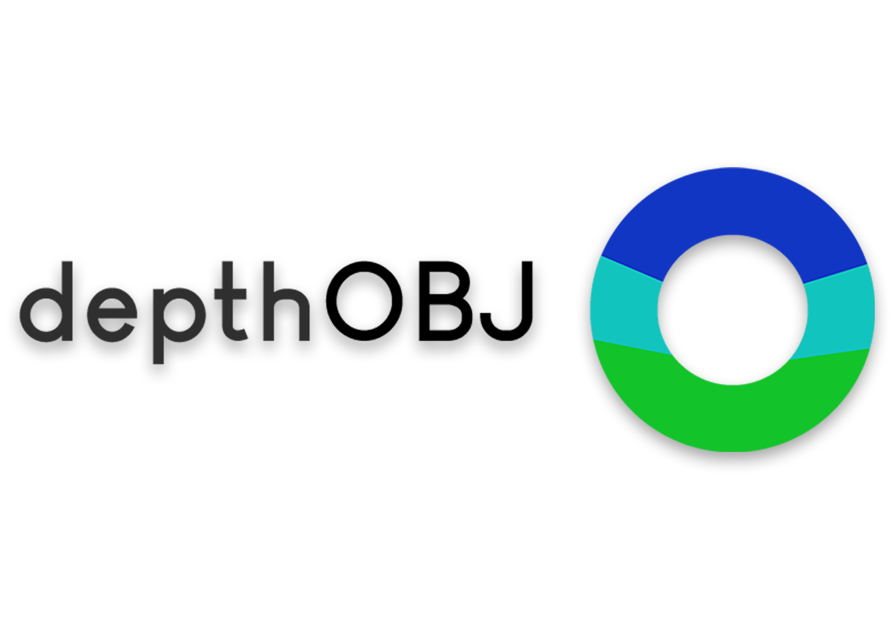
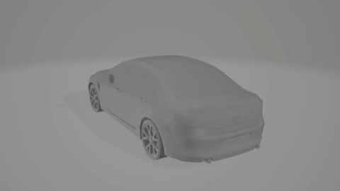

 

*A syntethic Dataset containing 19440 depth maps divided in 54 categories, with one representative 3D mesh model in .OBJ format for each category.*

# **Why depthOBJ**

While hundreds of thousand of datasets for coloured RGB images are available on the web, very few and small datasets dedicated to depth maps are actually available for researchers and amateurs. 
Even if the capabilities of RGB images are astounding, the need to explore depth maps, images describing the depth of a scene or an object, is absolutely trivial. Moreover for the fact that this kind of images can be compressed into a single channel, being able to pair them with their corresponding RGB counterparts, opening up to RGB-D images, a powerful yet not-that-much explored tool. </br>
`depthOBJ` is also engineered to be very easily implementable in Deep Learning applications, thanks to it's easy-to-read taxonomy, studied to be ready to use with Keras' `DataGenerators`.

## Taxonomy
As said, the taxonomy represents one of the most defining aspects of the dataset. Thought to be easy to understand and implement, the dataset is ready to be imported in most of the applcations that run on Keras. 

`depthOBJ` 
<details><summary>\depthOBJ</summary>
<p>
    <details><summary>\Images</summary>
    <p>


            - \bag
            - \basket
            - \bathtub
            - \bed
            - \bench
            - \birdhouse
            - \bookshelf
            - \bottle
            - \bowl
            - \bus
            - \cabinet
            - \camera
            - \can
            - \cap
            - \car
            - \cellphone
            - \chair
            - \clock
            - \dishwasher
            - \display
            - \earphone
            - \faucet
            - \file cabinet
            - \guitar
            - \helmet
            - \jar
            - \keyboard
            - \knife
            - \lamp
            - \laptop
            - \mailbox
            - \microphone
            - \microwave
            - \motorcycle
            - \mug
            - \piano
            - \pillow
            - \pistol
            - \plane
            - \pot
            - \printer
            - \projectile
            - \remote
            - \rifle
            - \skateboard
            - \sofa
            - \speaker
            - \stove
            - \table
            - \tower 
            - \train
            - \trashcan
            - \washer
            - \watercraft

</p>
</details>
<details><summary>\Models</summary>
<p>

        - bag.obj
        - basket.obj
        - bathtub.obj
        - bed.obj
        - bench.obj
        - birdhouse.obj
        - bookshelf.obj
        - bottle.obj
        - bowl.obj
        - bus.obj
        - cabinet.obj
        - camera.obj
        - can.obj
        - cap.obj
        - car.obj
        - cellphone.obj
        - chair.obj
        - clock.obj
        - dishwasher.obj
        - display.obj
        - earphone.obj
        - faucet.obj
        - file cabinet.obj
        - guitar.obj
        - helmet.obj
        - jar.obj
        - keyboard.obj
        - knife.obj
        - lamp.obj
        - laptop.obj
        - mailbox.obj
        - microphone.obj
        - microwave.obj
        - motorcycle.obj
        - mug.obj
        - piano.obj
        - pillow.obj
        - pistol.obj
        - plane.obj
        - pot.obj
        - printer.obj
        - projectile.obj
        - remote.obj
        - rifle.obj
        - skateboard.obj
        - sofa.obj
        - speaker.obj
        - stove.obj
        - table.obj
        - tower.obj
        - train.obj
        - trashcan.obj
        - washer.obj
        - watercraft.obj
        
</p>
</details>

</p>
</details>


# Usage 
Using 'depthOBJ' is fast and easy. </br>
Here an example running on Google Colaboratory.</br>
- *mount the drive [only on colab]*
    ```
    from google.colab import drive
    drive.mount('/content/drive')
    ```
- *directories of depthOBJ*
    ```
    data_dir = '/content/drive/My Drive/depthOBJ'
    images_path = data_dir + '/Images/'
    models_path = data_dir + '/Models/'
    ```
- *create the data generator to handle images from folders*
    ```
    datagen = ImageDataGenerator(rotation_range=5, 
                             horizontal_flip=True, 
                             width_shift_range=0.1, 
                             height_shift_range=0.1,
                             validation_split = 0.2)
    ```
- *generate data for the training and validation*
    ```
    train_image_gen = datagen.flow_from_directory(images_path,
                                              target_size=image_shape[:2], 
                                              color_mode='rgb', 
                                              batch_size=batch_size, 
                                              class_mode='categorical', 
                                              shuffle=True,
                                              subset = 'training')


    valid_image_gen = datagen.flow_from_directory(images_path,
                                                target_size=image_shape[:2],
                                                color_mode='rgb', 
                                                batch_size=batch_size, 
                                                class_mode='categorical', 
                                                shuffle=False,
                                                subset = 'validation')
    ```

Now, the dataset is ready to be used to train Neural Networks' models. 

# Images and Representative Models
The dataset is composed by 19440 - coloured just for the sake of it - depth maps, with one representative 3D mesh collected from [ShapeNet](https://www.shapenet.org/) Core V2 dataset, from which we also collected the meshes to render out the depth maps. </br>
The representative meshes are selected following these criteria:
> - **generality:** the idea behind representativity can be build around the common image that comes to mind usually when thinking about an object. While different designs are often found around us, a chair remains a chair and a bed remains a bed. Choosing our representative mesh, we tried to keep faith to this idea of generality.
> - **size:** we tried to limit the size of our files in a way that they could still be very detailed, but also not too heavy. 
> - **topology:** a clean topology is crucial for the quality of the final application and was also a big focus for allowing future applications that could act on feature-based deformation and transformation.

***

3D mesh .OBJ             |  depth map
:------------------------:|:-------------------------:
 | 
|

# Grow the Dataset
The nature of `depthOBJ` is to be easy and ready to use, but also to be a starting point for future expansion. The dataset has been generated completely on [Blender](https://www.blender.org/) and can be expanded through the batch-rendering script we made available. 

# Thanks
Special thanks go to professor Lauro Snidaro for supervising and following with unestimable competence and presence all the work that `depthOBJ` required. 